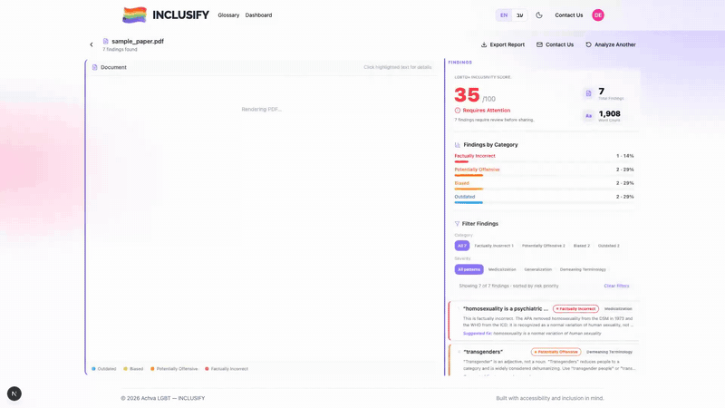
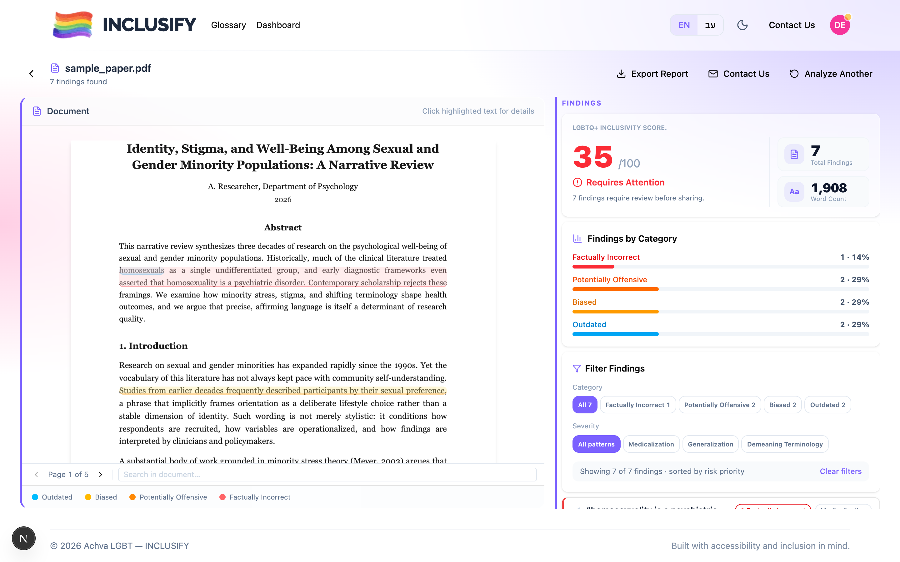
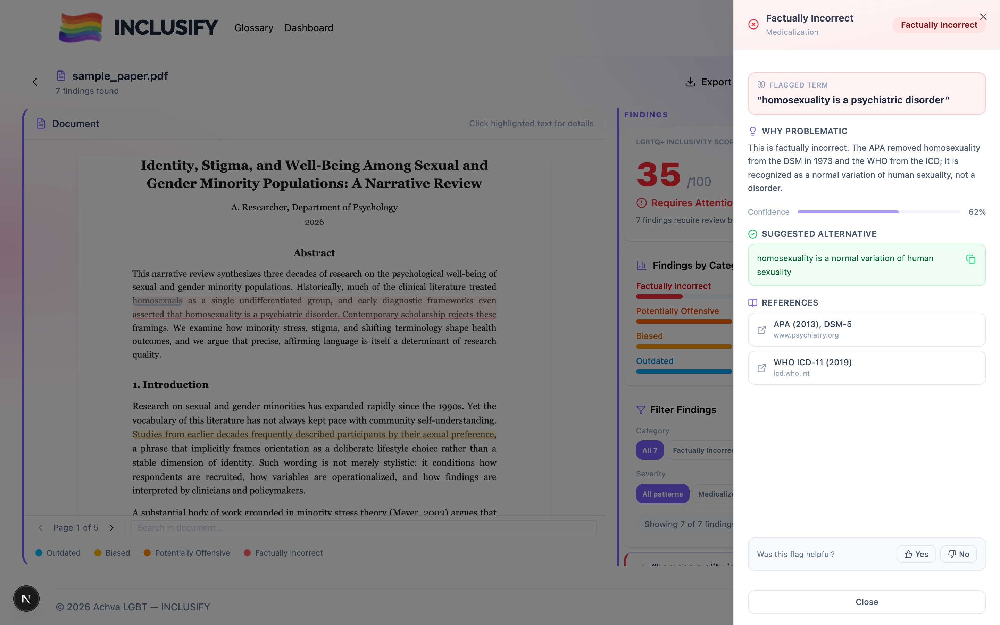
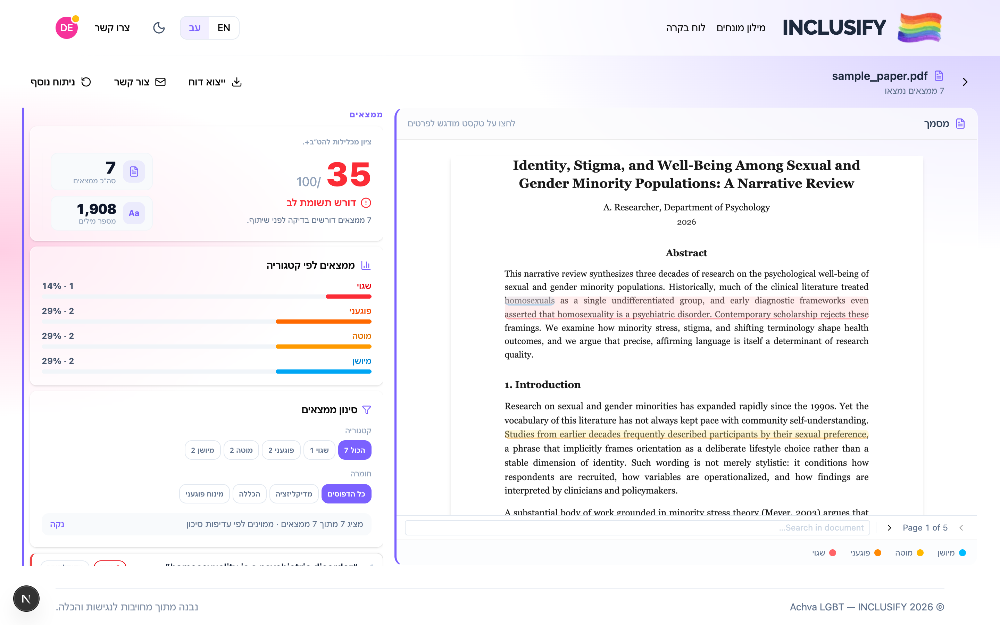
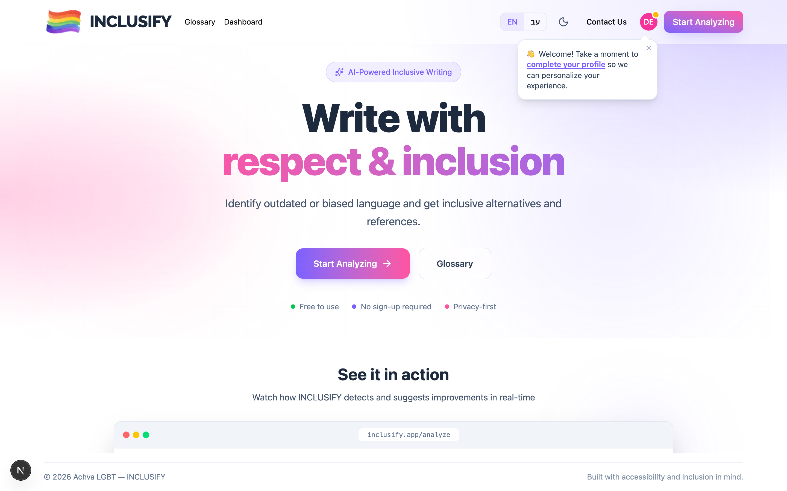
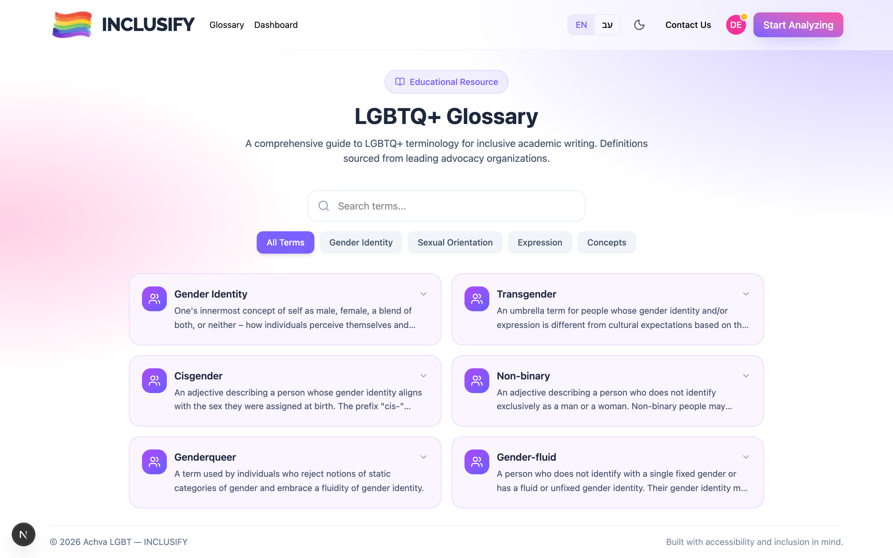
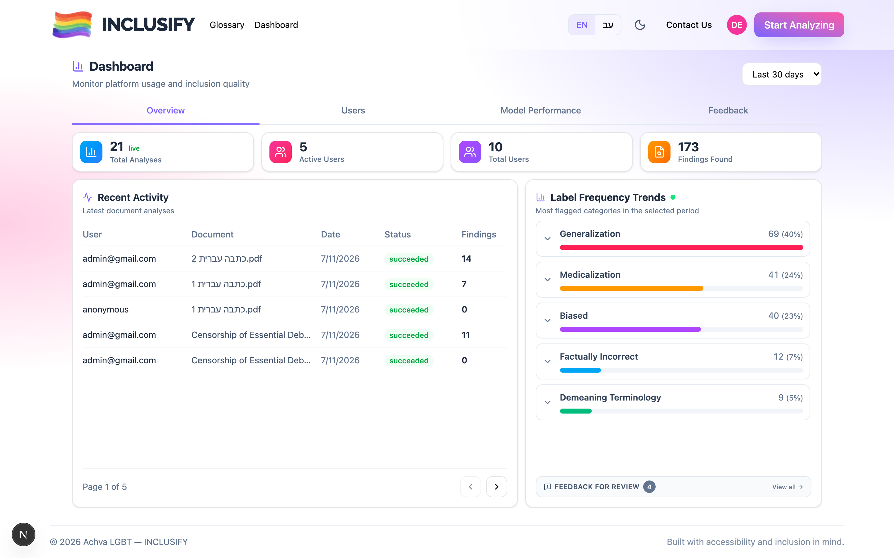
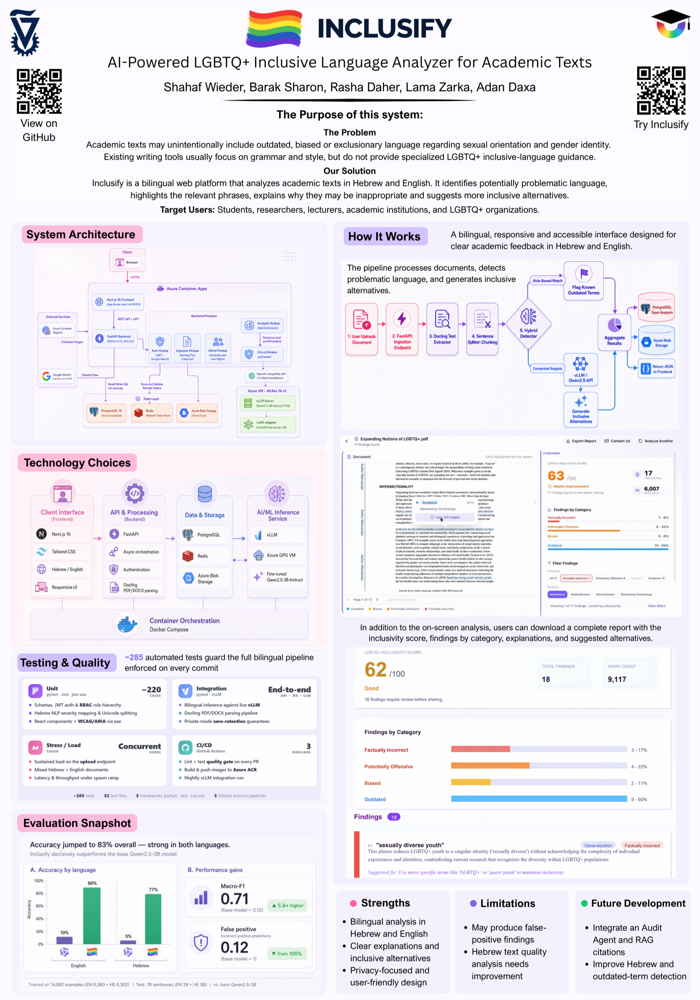

<div align="center">


**LGBTQ+ Inclusive Language Analyzer for Academic Texts**

Inclusify is an NLP-powered web platform developed in partnership with the **Achva LGBT Organization**. It helps researchers, editors, and authors identify LGBTQphobic, outdated, biased, or pathologizing language in academic texts — in both Hebrew and English — and suggests inclusive alternatives.

Built as a final academic project at the Technion by a team of five, and delivered as a working product to Achva.


<br/>



_▶️ **[Watch the full 50-second walkthrough](docs/media/inclusify-demo.mp4)**_

<!-- To embed an inline video PLAYER (instead of a link): open this README in the GitHub web
     editor and drag docs/media/inclusify-demo.mp4 into it — GitHub uploads it and inserts a
     player automatically. The GIF above already autoplays inline. -->

</div>

---

## What It Does

- Detects problematic language with **severity grading** (High / Medium / Low)
- Provides **educational explanations** and **inclusive alternatives** per finding
- Supports **Hebrew and English** academic texts with full RTL layout
- Generates **downloadable reports** for authors and editors
- **Private mode**: analysis without storing any text to the database
- **Admin dashboard**: usage analytics, glossary management, model performance monitoring

---

## Tech Stack

| Layer | Technologies |
|-------|-------------|
| **Frontend** | Next.js 16 (App Router), TypeScript, Tailwind v4, Framer Motion, next-intl |
| **Backend** | FastAPI, Python 3.11, Pydantic v2, asyncpg |
| **Database** | PostgreSQL 16 |
| **ML/AI** | QLoRA fine-tuned Qwen2.5-3B-Instruct, vLLM, Docling |
| **Infrastructure** | Microsoft Azure, Docker (multi-stage builds), GitHub Actions |

---

## Local Development

The full stack runs via Docker Compose — Postgres, Redis, an Azure Blob emulator (Azurite), the FastAPI backend, and the Next.js frontend.

```bash
# Start everything with hot-reload (backend :8000, frontend :3000)
docker compose --profile dev up

# Apply DB schema + seed (run once; auto-applied on first postgres start)
psql -f db/schema.sql && psql -f db/seed.sql
```

Copy `.env.example` to `.env` and fill in secrets (JWT, Google OAuth, Resend, `VLLM_URL`) before starting.

### Production images

```bash
# Build the slim production images
BUILD_TARGET=runtime docker compose build
```

`BUILD_TARGET` selects the Dockerfile stage for both services. The default (`development`) ships hot-reload and full dependencies; `runtime` produces the optimized, slim production images.

The backend installs **CPU-only PyTorch**. Inference runs remotely over HTTP (`VLLM_URL` → vLLM on the Azure GPU VM), so the CUDA build of torch — pulled transitively by Docling — would add ~3.5 GB of `nvidia`/`triton` libraries that are never executed in this container. Do not "upgrade" to the default torch wheel.

---

## Screenshots

### Analysis Results
The document on the left, severity-graded findings and an LGBTQ+ inclusivity score on the right.


### Finding Detail
Click any finding for the explanation, model confidence, inclusive alternative, and references.


### Hebrew / RTL
Full right-to-left layout with a bilingual interface.


### Landing Page


### Glossary


### Admin Dashboard


---

## Project Poster

<div align="center">
<a href="docs/Inclusify-Poster.pdf"></a>

_📄 **[View the full poster (PDF)](docs/Inclusify-Poster.pdf)**_
</div>

---

## Team

**Shahaf Wieder, Barak Sharon, Rasha Daher, Lama Zarka, Adan Daxa**  
Technion — Israel Institute of Technology, 2025–2026

---

## Acknowledgments

- [Achva LGBT Organization](https://achva-lgbt.org.il/) — partner organization and domain expertise
- [Qwen](https://huggingface.co/Qwen) — base model
- [Docling](https://github.com/DS4SD/docling) — document parsing
